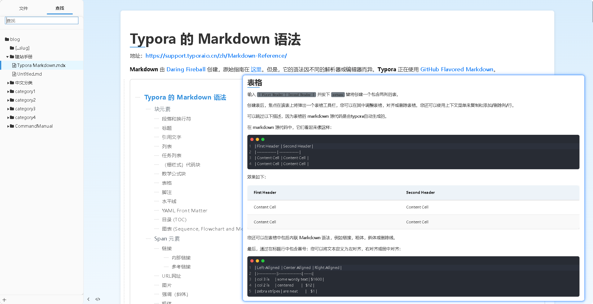
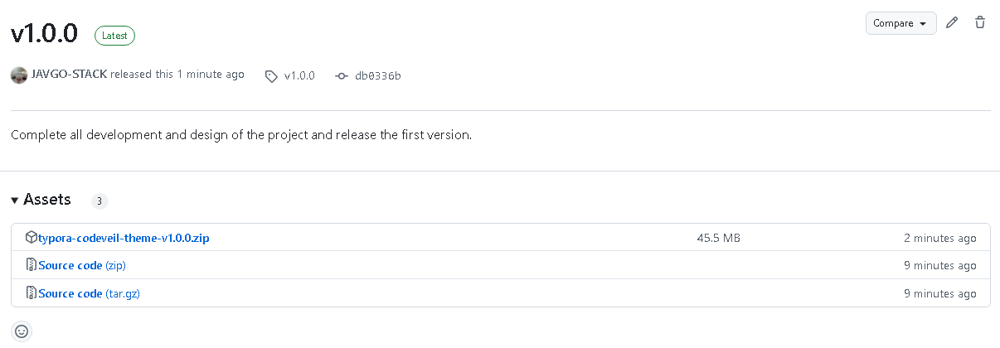
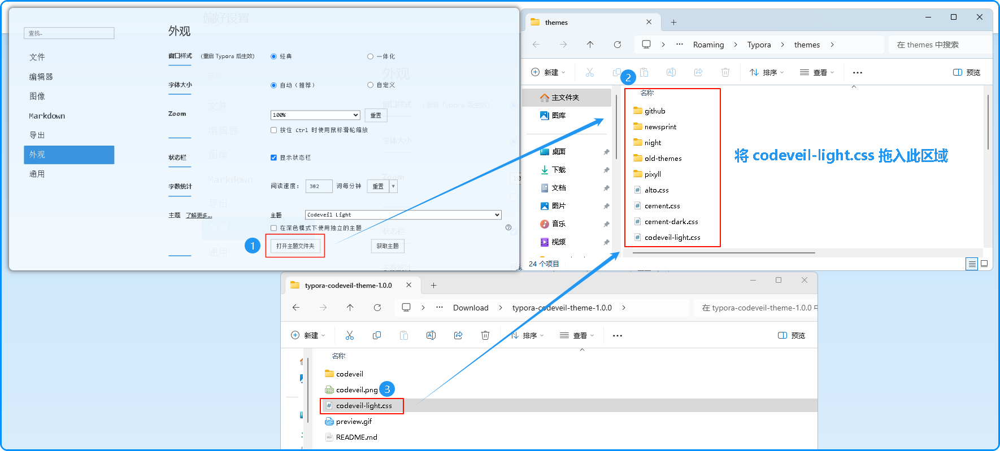
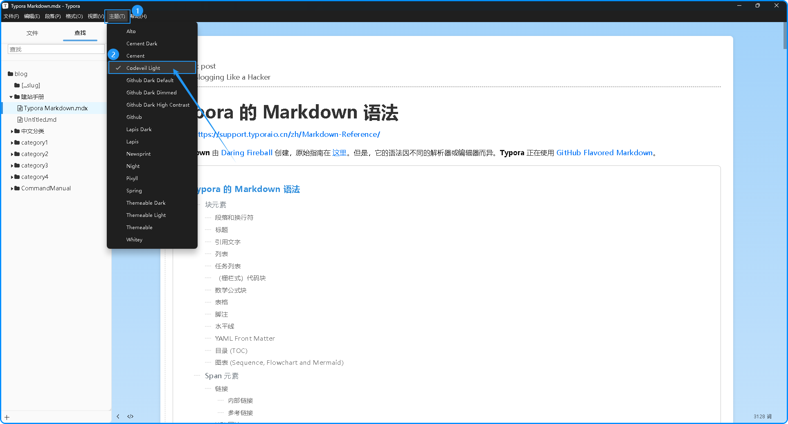

# CodeVeil Theme

## 关于 CodeVeil 主题

有没有遇到过这样的情况？当你打开 Typora，却发现主题界面让你有点抓狂。作为一个自称的强迫症爱好者，我总是希望界面既美观又整洁，能让我专注于内容创作。

于是，CodeVeil 诞生了！这是我对现有 Typora 主题的一次有趣改造，融合了 [Vercel](https://theme.typoraio.cn/theme/Vercel/) 和 [Spring](https://theme.typoraio.cn/theme/SprIng/) 主题的亮点，旨在为你带来既舒适又时尚的写作体验。

### 为什么选择 CodeVeil？

- **定制化美学**：结合 Vercel 的简洁设计，优化了样式和布局，让阅读更加轻松愉快。
- **增强的偏好设置**：借鉴 Spring 主题的元素，使 Typora 的偏好设置更加直观且富有视觉吸引力。
- **美观的 Markdown 样式**：每个常见的 Markdown 元素都经过精心设计，提升可读性和美感。

### 安装

1. **[下载](https://github.com/JAVGO-STACK/typora-codeveil-theme/releases/tag/v1.0.0)** 项目的压缩包，从 [GitHub](https://github.com/JAVGO-STACK/typora-codeveil-theme/releases/tag/v1.0.0)。

2. **复制** `codeveil-light.css` 文件和 `codeveil` 文件夹到你的 Typora 主题库。

3. **启动** 或重启 Typora，并从主题菜单中选择 **CodeVeil Light**。

### 预览

### 贡献

这是 CodeVeil 的第一个版本。如果你有想法或改进，欢迎 **Fork** 项目并给它一个 **Star** ⭐️。有了绝妙的建议？打开一个 **[Issue](https://github.com/JAVGO-STACK/typora-codeveil-theme/issues/new)** 或提交一个 **[Pull Request](https://github.com/JAVGO-STACK/typora-codeveil-theme/pulls)**。让我们一起让 Markdown 变得更加美丽！

## 声明

本主题学习自下面两个优秀的主题：👍

* [Vercel](https://theme.typoraio.cn/theme/Vercel/)：主要内容基于 Vercel 进行二次开发；
* [Spring](https://theme.typoraio.cn/theme/SprIng/)：参考了 Spring 对于定制 Typora Preference 的相关类名。